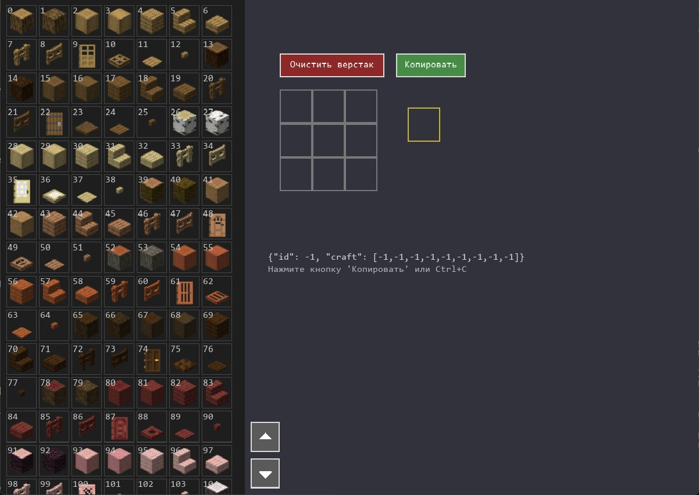

# 🎮 Craft Editor

Небольшой визуальный редактор рецептов крафта на **Python + Pygame**.

Позволяет быстро собирать рецепты в сетке **3x3** и экспортировать их в JSON.

---

## ✨ Возможности

- 📦 Нарезка спрайт-листа на тайлы (32x32)
- 🧱 Drag & Drop интерфейс
- 🧪 Сетка крафта 3x3
- 🎯 Выбор результата
- 🧾 Автоматическая генерация JSON
- 📋 Копирование в буфер обмена
- 🧹 Быстрая очистка верстака

---

## 🖥 Интерфейс

- **Слева** — список всех тайлов  
- **По центру** — верстак 3x3  
- **Справа** — результат  

---

## 📄 Формат JSON

```json
{"id": 10, "craft": [1,2,3,4,5,6,7,8,9]}
```

Если сетка пустая:

```json
{"id": 10, "craft": [-99,-1,-1,-1,-1,-1,-1,-1,-1]}
```

---

## ⚙️ Установка

```bash
pip install pygame pillow numpy pyperclip
```

---

## ▶️ Запуск

```bash
python main.py
```

---

## 🔧 Настройки

```python
SPRITE_PATH = "sprite (2).webp"

TILE_W = 32
TILE_H = 32
```

Порядок тайлов:
- слева → направо
- сверху → вниз

---

## 🎮 Управление

| Действие | Кнопка |
|--------|--------|
| Взять тайл | ЛКМ |
| Перетащить | Drag & Drop |
| Прокрутка | Колесо мыши |
| Очистить | Delete |
| Копировать | Ctrl + C |

---

## 📁 Структура проекта

```
.
├── main.py
├── sprite (2).webp
└── README.md
```

---

## 🔌 Зависимости

- pygame
- pillow
- numpy
- pyperclip

---

## 🚀 Планы

- удаление отдельных ячеек
- сохранение в файл
- поиск по тайлам
- разные размеры сетки
- автосохранение

---

## 📸 Скриншот

Добавь сюда:

```

```

---

## 📜 Лицензия

MIT License
